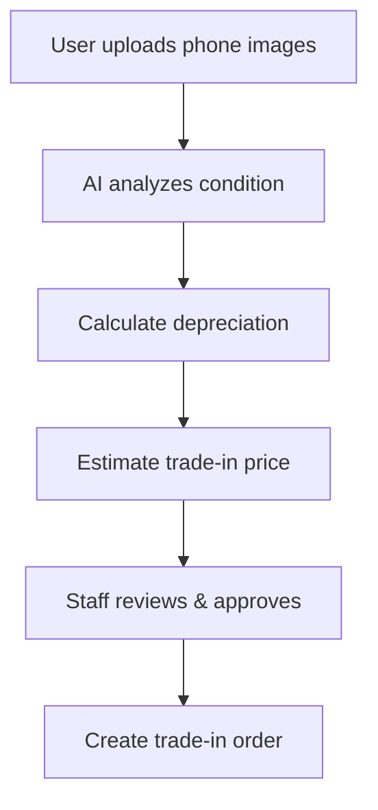

# Hệ Thống AI Diagnostic - Đánh Giá Chất Lượng Điện Thoại

> **Tài liệu hướng dẫn triển khai và sử dụng hệ thống AI diagnostic cho ứng dụng Trade-In điện thoại**

---

## 📋 Tổng Quan

Hệ thống này sử dụng **BLIP Vision AI** để tự động phân tích hình ảnh điện thoại và đánh giá tình trạng ngoại hình qua 7 tiêu chí:

| Tiêu chí | Mô tả | Trọng số |
|----------|-------|----------|
| **Screen Cracks** | Vết nứt trên màn hình | 25% |
| **Display Failure** | Lỗi hiển thị | 20% |
| **Scratches** | Vết trầy xước | 15% |
| **Edge Dings** | Móp méo cạnh | 10% |
| **Dents** | Lõm thân máy | 10% |
| **Dead Pixels** | Điểm chết | 10% |
| **Display Lines** | Đường sọc màn hình | 10% |

**Kết quả**: Điểm tổng hao mòn (0-100%) và đánh giá tổng thể (Excellent/Good/Fair/Poor)

---

## 🏗️ Kiến Trúc Hệ Thống

```
┌─────────────────┐      ┌──────────────────┐      ┌─────────────────┐
│   Frontend      │─────▶│  Spring Boot     │─────▶│  Flask AI API   │
│   (React)       │      │   Backend        │      │   (Python)      │
└─────────────────┘      └──────────────────┘      └─────────────────┘
                               │                           │
                               │                           │
                               ▼                           ▼
                         ┌──────────┐              ┌──────────┐
                         │PostgreSQL│              │   BLIP   │
                         │ Database │              │  Model   │
                         └──────────┘              └──────────┘
```

###Flow:
1. **User** upload ảnh qua frontend
2. **Frontend** gửi request đến Spring Boot API
3. **Spring Boot** gọi Flask AI API với ảnh
4. **Flask** phân tích ảnh bằng BLIP model
5. **Flask** trả về kết quả diagnostic
6. **Spring Boot** lưu kết quả vào database
7. **Frontend** hiển thị kết quả cho user

---

## 📁 Cấu Trúc Files

### Backend (Java Spring Boot)

```
BackEnd/
├── src/main/java/com/eaut/backend/
│   ├── controller/
│   │   └── ProductDiagnosticController.java     # REST API endpoints
│   ├── service/
│   │   └── ProductDiagnosticService.java        # Business logic
│   ├── repository/
│   │   └── ProductDiagnosticRepository.java     # Database access
│   ├── entities/
│   │   └── ProductDiagnostic.java               # JPA entity
│   ├── model/
│   │   ├── request/
│   │   │   └── DiagnosticRequest.java           # Request DTO
│   │   └── response/
│   │       ├── DiagnosticResponse.java          # AI response DTO
│   │       └── ProductDiagnosticDTO.java        # Response DTO
│   └── config/
│       └── RestTemplateConfig.java              # HTTP client config
└── src/main/resources/
    └── application.yaml                         # Config file
```

### AI Server (Python Flask)

```
aiServer/
├── phone_diagnostic_api.py                      # Flask API server
├── requirements.txt                             # Python dependencies
└── README_VI.md                                 # Documentation
```

---

## 🚀 Cài Đặt và Chạy

### 1. Setup Flask AI Server

#### Bước 1: Cài đặt dependencies

```bash
cd aiServer

# Tạo virtual environment (khuyến nghị)
python -m venv venv
venv\Scripts\activate  # Windows
# source venv/bin/activate  # Linux/Mac

# Cài đặt packages
pip install -r requirements.txt
```

#### Bước 2: Chạy Flask server

```bash
python phone_diagnostic_api.py
```

**Output**:
```
======================================================================
INITIALIZING PHONE DIAGNOSTIC API
======================================================================
[INFO] Using device: CPU
[INFO] Loading BLIP model...
[SUCCESS] Model loaded and ready!
======================================================================

[INFO] Starting Flask server...
[INFO] API Endpoints:
  - GET  /health              - Health check
  - POST /api/diagnose        - Single image diagnostic
  - POST /api/batch-diagnose  - Batch image diagnostic

[INFO] Server running on http://localhost:5000
======================================================================
```

#### Bước 3: Test Flask API

```bash
# Health check
curl http://localhost:5000/health

# Test với ảnh
curl -X POST http://localhost:5000/api/diagnose \
  -F "file=@path/to/phone_image.jpg"
```

---

### 2. Setup Spring Boot Backend

#### Bước 1: Kiểm tra cấu hình

File [`application.yaml`](file:///d:/DONGA/nam4/DATN/buysellphoneold/BackEnd/src/main/resources/application.yaml):

```yaml
# Cấu hình AI Diagnostic Service (Flask API)
ai:
  diagnostic:
    api:
      url: "http://localhost:5000"  # Flask API endpoint
      timeout: 60000  # 60 seconds
```

#### Bước 2: Build và chạy Spring Boot

```bash
cd BackEnd
./mvnw clean install
./mvnw spring-boot:run
```

#### Bước 3: Test Spring Boot API

Swagger UI: `http://localhost:8080/api/swagger-ui.html`

---

## 📡 API Endpoints

### Flask AI Server

#### 1. Health Check
```http
GET /health
```

**Response**:
```json
{
  "status": "healthy",
  "model_loaded": true,
  "device": "cpu",
  "timestamp": "2026-01-23T11:00:00"
}
```

#### 2. Analyze Phone (Multipart)
```http
POST /api/diagnose
Content-Type: multipart/form-data

file: [image file]
```

**Response**:
```json
{
  "success": true,
  "timestamp": "2026-01-23T11:00:00",
  "diagnostic": {
    "screenCracks": 15.5,
    "scratches": 25.0,
    "edgeDings": 10.0,
    "dents": 5.0,
    "displayFailure": 0.0,
    "deadPixels": 0.0,
    "displayLines": 0.0,
    "totalDepreciation": 12.75,
    "overallAssessment": "Good - Thiết bị trong tình trạng khá tốt...",
    "analysisDetails": {
      "screenAnalysis": "the screen condition shows minor scratches",
      "scratchAnalysis": "the surface scratches are light",
      ...
    }
  }
}
```

#### 3. Analyze Phone (Base64)
```http
POST /api/diagnose
Content-Type: application/json

{
  "image": "data:image/jpeg;base64,/9j/4AAQSkZJRg..."
}
```

---

### Spring Boot Backend

Base URL: `http://localhost:8080/api`

#### 1. Analyze Phone and Save to Database
```http
POST /api/diagnostics/analyze
Content-Type: multipart/form-data

productItemId: [UUID]
image: [file]
staffId: [UUID] (optional)
additionalNotes: [string] (optional)
```

**Response**:
```json
{
  "id": "550e8400-e29b-41d4-a716-446655440000",
  "productItemId": "550e8400-e29b-41d4-a716-446655440001",
  "screenCracks": 15.5,
  "scratches": 25.0,
  "edgeDings": 10.0,
  "dents": 5.0,
  "displayFailure": 0.0,
  "deadPixels": 0.0,
  "displayLines": 0.0,
  "totalDepreciation": 12.75,
  "overallAssessment": "Good - Thiết bị trong tình trạng khá tốt...",
  "status": "tested",
  "testDate": "2026-01-23",
  "staffId": "550e8400-e29b-41d4-a716-446655440002",
  "staffName": "Nguyễn Văn A",
  "aiAnalysisDetails": "{\"screenAnalysis\":\"...\"}"
}
```

#### 2. Get Diagnostics by Product Item
```http
GET /api/diagnostics/product-item/{productItemId}
```

#### 3. Get Latest Diagnostic
```http
GET /api/diagnostics/product-item/{productItemId}/latest
```

#### 4. Get Diagnostic by ID
```http
GET /api/diagnostics/{diagnosticId}
```

#### 5. Update Diagnostic
```http
PUT /api/diagnostics/{diagnosticId}
Content-Type: application/json

{
  "screenCracks": 20.0,
  "additionalNotes": "Updated by staff",
  "estimatedRepairCost": 500000
}
```

#### 6. Delete Diagnostic
```http
DELETE /api/diagnostics/{diagnosticId}
```

---

## 💾 Database Schema

### Table: `product_diagnostics`

```sql
CREATE TABLE product_diagnostics (
    id UUID PRIMARY KEY,
    product_item_id UUID NOT NULL REFERENCES product_items(id),
    staff_id UUID REFERENCES users(id),
    
    -- Screen conditions (0-100)
    screen_cracks DECIMAL(5,2) NOT NULL DEFAULT 0,
    scratches DECIMAL(5,2) NOT NULL DEFAULT 0,
    edge_dings DECIMAL(5,2) NOT NULL DEFAULT 0,
    dents DECIMAL(5,2) NOT NULL DEFAULT 0,
    display_failure DECIMAL(5,2) NOT NULL DEFAULT 0,
    dead_pixels DECIMAL(5,2) NOT NULL DEFAULT 0,
    display_lines DECIMAL(5,2) NOT NULL DEFAULT 0,
    
    -- Overall assessment
    total_depreciation DECIMAL(5,2) NOT NULL DEFAULT 0,
    overall_assessment TEXT,
    
    -- Hardware (boolean flags)
    microphone_damage BOOLEAN,
    front_camera_damage BOOLEAN,
    rear_camera_damage BOOLEAN,
    charging_port_damage BOOLEAN,
    speaker_damage BOOLEAN,
    button_damage BOOLEAN,
    wifi_bluetooth_issue BOOLEAN,
    
    -- Battery
    battery_health DECIMAL(5,2),
    
    -- Metadata
    status VARCHAR(20) DEFAULT 'pending',
    test_date DATE DEFAULT CURRENT_DATE,
    additional_notes TEXT,
    repair_recommendations TEXT,
    estimated_repair_cost DECIMAL(12,2),
    
    -- Audit fields
    created_at TIMESTAMP DEFAULT CURRENT_TIMESTAMP,
    updated_at TIMESTAMP DEFAULT CURRENT_TIMESTAMP
);
```

---

## 🧪 Testing

### Test Flask API với curl

```bash
# 1. Health check
curl http://localhost:5000/health

# 2. Analyze single image
curl -X POST http://localhost:5000/api/diagnose \
  -F "file=@D:/DONGA/nam4/DATN/buysellphoneold/img/image_old/IMG_5420.PNG"

# 3. Analyze with base64
curl -X POST http://localhost:5000/api/diagnose \
  -H "Content-Type: application/json" \
  -d '{
    "image": "data:image/png;base64,iVBORw0KGgoAAAANSUhEUgAA..."
  }'
```

### Test Spring Boot API với Postman

**Request: Analyze Phone**
```
POST http://localhost:8080/api/diagnostics/analyze
Content-Type: multipart/form-data

Form Data:
- productItemId: 550e8400-e29b-41d4-a716-446655440001
- image: [select file]
- staffId: 550e8400-e29b-41d4-a716-446655440002
- additionalNotes: Test diagnostic
```

---

## 🔧 Tích Hợp Frontend

### React Example

```jsx
import React, { useState } from 'react';
import axios from 'axios';

function PhoneDiagnostic({ productItemId }) {
  const [file, setFile] = useState(null);
  const [result, setResult] = useState(null);
  const [loading, setLoading] = useState(false);

  const handleFileChange = (e) => {
    setFile(e.target.files[0]);
  };

  const analyzPhone = async () => {
    if (!file) return;

    setLoading(true);
    const formData = new FormData();
    formData.append('productItemId', productItemId);
    formData.append('image', file);
    formData.append('additionalNotes', 'Analyzed via web UI');

    try {
      const response = await axios.post(
        'http://localhost:8080/api/diagnostics/analyze',
        formData,
        {
          headers: {
            'Content-Type': 'multipart/form-data',
          },
        }
      );
      setResult(response.data);
    } catch (error) {
      console.error('Diagnostic failed:', error);
      alert('Failed to analyze phone');
    } finally {
      setLoading(false);
    }
  };

  return (
    <div className="phone-diagnostic">
      <h2>Phone Diagnostic</h2>
      
      <div className="upload-section">
        <input
          type="file"
          accept="image/*"
          onChange={handleFileChange}
        />
        <button onClick={analyzePhone} disabled={!file || loading}>
          {loading ? 'Analyzing...' : 'Analyze Phone'}
        </button>
      </div>

      {result && (
        <div className="result">
          <h3>Diagnostic Result</h3>
          
          <div className="overall">
            <p><strong>Total Depreciation:</strong> {result.totalDepreciation}%</p>
            <p><strong>Assessment:</strong> {result.overallAssessment}</p>
          </div>

          <div className="details">
            <h4>Condition Details:</h4>
            <ul>
              <li>Screen Cracks: {result.screenCracks}%</li>
              <li>Scratches: {result.scratches}%</li>
              <li>Edge Dings: {result.edgeDings}%</li>
              <li>Dents: {result.dents}%</li>
              <li>Display Failure: {result.displayFailure}%</li>
              <li>Dead Pixels: {result.deadPixels}%</li>
              <li>Display Lines: {result.displayLines}%</li>
            </ul>
          </div>

          <div className="metadata">
            <p><strong>Test Date:</strong> {result.testDate}</p>
            <p><strong>Status:</strong> {result.status}</p>
            <p><strong>Diagnostic ID:</strong> {result.id}</p>
          </div>
        </div>
      )}
    </div>
  );
}

export default PhoneDiagnostic;
```

---

## ⚙️ Cấu Hình Nâng Cao

### 1. Sử dụng GPU cho Flask

**Cài đặt CUDA**:
```bash
# Check CUDA availability
python -c "import torch; print(torch.cuda.is_available())"

# Install PyTorch with CUDA
pip install torch torchvision --index-url https://download.pytorch.org/whl/cu118
```

**Performance**: GPU nhanh hơn CPU 5-10 lần

### 2. Deploy Flask với Gunicorn

```bash
pip install gunicorn

# Run with 4 workers
gunicorn -w 4 -b 0.0.0.0:5000 phone_diagnostic_api:app
```

### 3. Docker Deployment

**Dockerfile cho Flask**:
```dockerfile
FROM python:3.10-slim

WORKDIR /app

COPY requirements.txt .
RUN pip install --no-cache-dir -r requirements.txt

COPY phone_diagnostic_api.py .

EXPOSE 5000

CMD ["python", "phone_diagnostic_api.py"]
```

**Build và run**:
```bash
docker build -t phone-diagnostic-api .
docker run -p 5000:5000 phone-diagnostic-api
```

---

## 📈 Performance & Optimization

### Metrics

| Metric | CPU | GPU (RTX 3060) |
|--------|-----|----------------|
| Model Load Time | ~10s | ~5s |
| Per Image Analysis | 1-2s | 0.2-0.5s |
| Batch 10 images | 15-20s | 3-5s |

### Optimization Tips

1. **Model Caching**: Model chỉ load 1 lần khi start server
2. **Batch Processing**: Analyze nhiều ảnh cùng lúc
3. **Image Resize**: Resize ảnh về kích thước hợp lý (< 1024px)
4. **GPU Acceleration**: Sử dụng GPU nếu có

---

## 🐛 Troubleshooting

### Lỗi thường gặp

#### 1. Flask không start được

**Lỗi**: `ModuleNotFoundError: No module named 'transformers'`

**Giải pháp**:
```bash
pip install -r requirements.txt
```

#### 2. Out of memory

**Lỗi**: `RuntimeError: CUDA out of memory`

**Giải pháp**:
- Giảm kích thước ảnh input
- Chuyển sang CPU: `device = "cpu"`
- Tăng RAM/VRAM

#### 3. Connection refused

**Lỗi**: `Connection refused to http://localhost:5000`

**Giải pháp**:
- Kiểm tra Flask server đang chạy
- Kiểm tra port 5000 không bị chiếm
- Update URL trong `application.yaml`

#### 4. Slow analysis

**Nguyên nhân**: Chạy trên CPU

**Giải pháp**:
- Sử dụng GPU
- Resize ảnh nhỏ hơn
- Tăng timeout trong config

---

## 🔒 Security

### Best Practices

1. **File Upload Validation**
   - Check file type (image only)
   - Limit file size (< 10MB)
   - Scan for malware

2. **API Authentication**
   - Add JWT authentication
   - Rate limiting
   - CORS configuration

3. **Input Sanitization**
   - Validate product item ID
   - Escape special characters
   - SQL injection prevention

---

## 📊 Use Cases

### 1. Trade-In Flow



### 2. Quality Check

- Nhân viên kiểm tra điện thoại thu cũ
- Upload ảnh → AI đánh giá tự động
- Staff xem xét và điều chỉnh nếu cần
- Lưu kết quả vào database

### 3. Pricing Algorithm

```python
base_price = get_base_price(brand, model)
depreciation_rate = diagnostic.totalDepreciation / 100
final_price = base_price * (1 - depreciation_rate)
```

---

## 🚦 Roadmap

### Phase 1: Current ✅
- ✅ BLIP AI integration
- ✅ 7 condition criteria analysis
- ✅ Spring Boot integration
- ✅ Database persistence

### Phase 2: Next Steps 🔄
- 🔲 OCR for IMEI/Serial detection
- 🔲 Damage detection (YOLOv8)
- 🔲 Multiple image analysis
- 🔲 Fraud detection

### Phase 3: Advanced 🎯
- 🔲 Custom model fine-tuning
- 🔲 Real-time streaming
- 🔲 Mobile app integration
- 🔲 Automated pricing AI

---

## 📞 Support

Nếu gặp vấn đề, kiểm tra:

1. **Flask logs**: Console output của Flask server
2. **Spring Boot logs**: Check application logs
3. **Database**: Xem dữ liệu đã lưu chưa
4. **Network**: Test connectivity giữa services

---

## 📚 References

- [BLIP Model](https://huggingface.co/Salesforce/blip-image-captioning-base)
- [Flask Documentation](https://flask.palletsprojects.com/)
- [Spring Boot](https://spring.io/projects/spring-boot)
- [PostgreSQL](https://www.postgresql.org/)

---

**Created**: 2026-01-23  
**Version**: 1.0  
**Author**: AI Development Team
